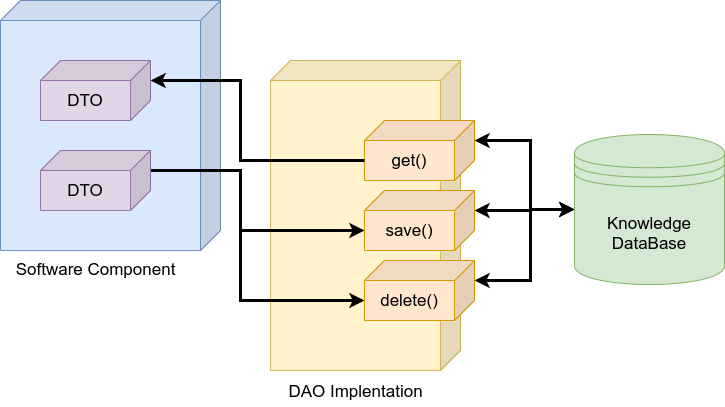

# KANT (Knowledge mAnagemeNT)

This is a ROS 2 tool to manage PDDL-based knowledge from Python code. It is based on several software design patterns (DTO, DAO, Factory).



## Table of Contents

1. [Features](#features)
2. [Installation](#installation)
3. [Knowledge Base](#knowledge-base)
4. [Experiments](#experiments)

## Installation

### Mongoengine

```shell
$ sudo pip3 install mongoengine dnspython
```

### Mongocxx

```shell
$ sudo apt install libmongoc-dev libmongoc-1.0-0 -y  # Ubuntu 20, mongoc 1.16.1

$ curl -OL https://github.com/mongodb/mongo-cxx-driver/archive/refs/tags/r3.4.2.tar.gz
$ tar -xzf r3.4.2.tar.gz

$ cd mongo-cxx-driver-r3.4.2/build
$ cmake .. -DCMAKE_BUILD_TYPE=Release -DCMAKE_INSTALL_PREFIX=/usr/local -DBSONCXX_POLY_USE_BOOST=1
$ cmake --build .
$ sudo cmake --build . --target install

$ export LD_LIBRARY_PATH=/usr/local/lib:$LD_LIBRARY_PATH
$ echo 'export LD_LIBRARY_PATH=/usr/local/lib:$LD_LIBRARY_PATH' >> ~/.bashrc

$ rm r3.4.2.tar.gz
$ rm -rf mongo-cxx-driver-r3.4.2
```

### Mongo

```shell
$ wget -qO - https://www.mongodb.org/static/pgp/server-4.4.asc | sudo apt-key add -
$ sudo apt-get install gnupg
$ wget -qO - https://www.mongodb.org/static/pgp/server-4.4.asc | sudo apt-key add -
$ echo "deb [ arch=amd64,arm64 ] https://repo.mongodb.org/apt/ubuntu focal/mongodb-org/4.4 multiverse" | sudo tee /etc/apt/$ sources.list.d/mongodb-org-4.4.list
$ sudo apt-get update
$ sudo apt-get install -y mongodb-org
$ sudo systemctl start mongod
```

### Mongo Compass (Optional)

https://docs.mongodb.com/compass/master/install/

### Kant

```shell
$ cd ~/ros2_ws/src
$ git clone git@github.com:uleroboticsgroup/simple_node.git
$ git clone git@github.com:uleroboticsgroup/kant.git
$ cd ~/ros2_ws
$ colcon build
```

## Features

There are two DAO families implemented:

- `MONGO`: this is a DAO family that uses MongoDB to storage the PDDL knowledge. Besides, the Mongoengine Python library is used to access MongoDB.
- `ROS2`: this is a DAO family that uses a ROS 2 node to storage the PDDL knowledge. ROS 2 services are used.

PDDL elements (DTOs) that can be used are:

- types
- objects
- predicates
- propositions
- goals
- actions (and durative)

## Knowledge Base

PDDL knowledge can be stored in a ROS 2 node or in a MongoDB database:

- MongoDB

```shell
$ sudo apt service mongod start
```

- ROS 2

```shell
$ ros2 run kant_knowledge_base knowledge_base_node.py
```

## Experiments

The In-Memory (ROS2) and MongoDB (MONGO) DAO families have been compared. The results of the performed experiment are presented [here](./Experiments/README.md).
